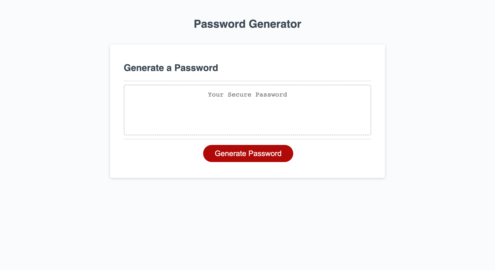

# JavaScript Password Generator

## Description

Project to create a password generator using js logic. The user is able to select a charater input from 8-128, consisting of upper, lowercase, numbers, and special characters. Upon run-time, a new randomized password is generated. 

## Links

* [Code Repository - Github](https://github.com/davisj33ry/password-generator)
* [Deployed Website](https://davisj33ry.github.io/password-generator/)

## Screenshot

